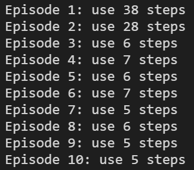
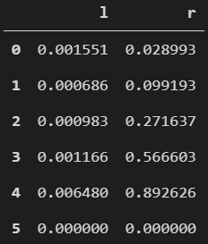

# 实验报告-强化学习

## Q-learning 过程

```
R = [...]    # m*n 维
Q = [0]      # m*n 维
探索率 = 0.8  # 0-1
学习率 = 0.8  # 0-1
折扣率 = 0.8  # 0-1

while (学习未结束):
	s = 随机状态
	while (单次训练未结束):
		a = 策略(s)
		s' = 执行(a)
		Q[s,a] = bellman(s,a,s')
		s = s'
return Q
```

- 参数介绍
  - $\varepsilon$：探索率，具体在 $\varepsilon-greedy$ 策略中描述
  - $\alpha$：学习率，学习率越大，对之前训练效果的保留就越少
  - $\Upsilon$：折扣率，折扣率越大，就越关心眼前的奖励而非记忆中将要获得的奖励
- 表格设计
  - $Q$：$Q$ 表，初始全为 0，行为状态，列为动作
  - $R$：奖励表，与 $Q$ 表同维度，记录了在某个状态执行某个动作后获得的奖励
    - 在本实验中，除了 $R[MAP\_SIZE-1,'r']=1$ 外，其余全为 0
- $\varepsilon-greedy$ 策略
  - 为了防止陷入局部最优
    - 如果我们只选择期望最大的 $a$ 执行
    - 在 $s_0$ 处执行 $a_1$ 后得到正奖赏，此时其它动作的期望都是 0
    - 以后每次处于这个 $s_0$ 都只会采用 $a_1$，即使执行其他动作能带来更大的奖励
  - 因此我们决定以 $\varepsilon$ 的概率随机执行动作，$(1-\varepsilon)$ 的概率按照期望执行动作
- $Q$ 值更新过程
  - 当前处于状态 $s$ 下
  - 通过策略得到当前动作 $a=\pi(s)$
  - 通过执行 $a$ 得到 $s'=m(s,a)$
  - 通过 Bellman 公式更新 $Q[s,a]$
    - $Q[s,a]=(1-\alpha)*Q[s,a]+\alpha*(R[s,a]+\Upsilon*max_a Q[s',a])$

## 实验代码

```python
import time
import pandas as pd
import numpy as np

# 设定随机数种子
np.random.seed(2)
# 刷新地图的间隔
INTERVAL = 0.2
# 最大训练次数
EPISODE = 10

# 地图长度: 默认最右为宝藏
MAP_SIZE = 6
# 动作: 只有 l-左 或 r-右
ACTIONS = ['l', 'r']
# 探索率
EXPLORE_RATE = 0.8
# 学习率
LEARN_RATE = 0.2
# 折扣因子
DISCOUNT_FAC = 0.9

# 初始化 R 表
def create_R():
    r_table = pd.DataFrame(
        np.zeros((MAP_SIZE, len(ACTIONS))),
        columns = ACTIONS
    )
    # 在宝藏左侧一格位置执行 'r' 的奖励设为 1
    r_table.loc[MAP_SIZE-2, 'r'] = 1
    return r_table

# 初始化 Q 表
def create_Q():
    return pd.DataFrame(
        np.zeros((MAP_SIZE, len(ACTIONS))),
        columns = ACTIONS
    )

# 选择下一步动作
def choose_action(state, q_table):
    rewards = q_table.iloc[state, :]
    if (np.random.uniform() > EXPLORE_RATE) or (rewards.all() == 0):
        next_action = np.random.choice(ACTIONS)
    else:
        next_action = rewards.idxmax()
    return next_action

# 执行动作
def move(state, action):
    if state == 0:
        if action == 'l':
            return 0
        else:
            return 1
    else:
        if action == 'l':
            return state - 1
        else:
            return state + 1

# 渲染当前地图/本次训练结果
def render(state, episode, counter):
    map = ['-'] * (MAP_SIZE - 1) + ['T']
    if state == MAP_SIZE - 1:
        print('\rEpisode %d: use %d steps' % (episode, counter))
        time.sleep(INTERVAL * 5)
    else:
        map[state] = 'o'
        print('\r%s' % (''.join(map)), end='')
        time.sleep(INTERVAL)

# 主体代码
def rl(r_table, q_table):
    for episode in range(EPISODE):
        counter = 0
        state = 0
        finish = False
        render(state, episode+1, counter)
        # 没有寻得宝藏就一直进行训练
        while not finish:
            action = choose_action(state, q_table)
            next_state = move(state, action)
            reward = r_table.loc[state, action]
            exp = 0
            # 宝藏位的 Q 表不会被更新, 因此 MAX(Q[S']) 始终为 0
            if next_state == MAP_SIZE - 1:
                exp = reward
                finish = True
            else:
                exp = reward + DISCOUNT_FAC * q_table.loc[next_state, :].max()
            # 通过 Bellman 公式更新 Q 表
            q_table.loc[state, action] += LEARN_RATE * exp - LEARN_RATE * q_table.loc[state, action]
            # 开始下一次移动
            state = next_state
            counter += 1
            render(state, episode+1, counter)
    return q_table

R = create_R()
Q = create_Q()
rl(R, Q)
```

## 实验结果

### 执行结果

> 有动态移动的过程，但没法截图下来，请执行代码观看



### 最终 Q 表

